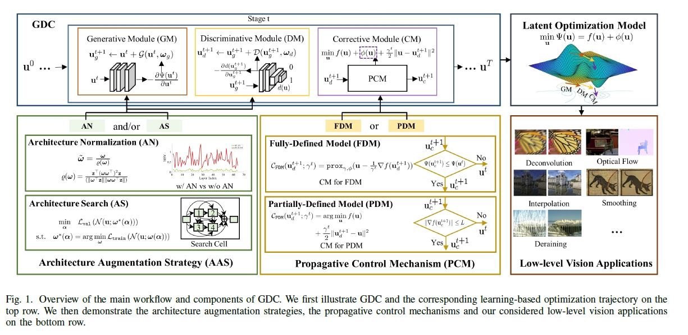
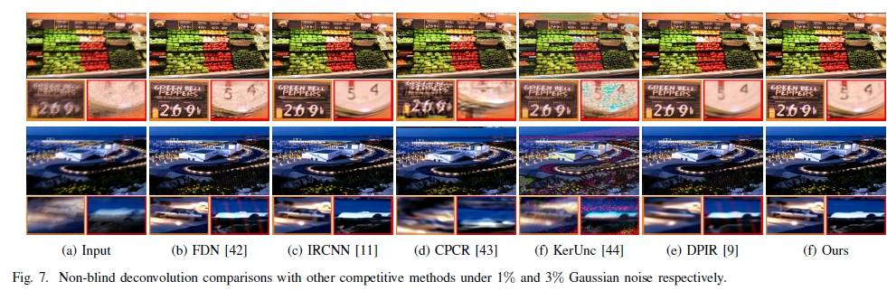
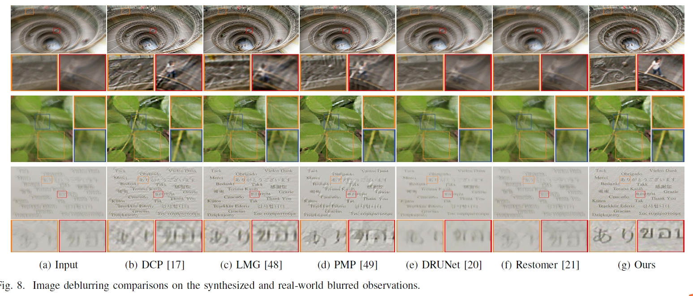
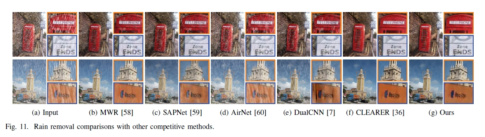

# GDC-OptimizationLearning
  Optimization-Inspired Learning with  Architecture Augmentations and Control Mechanisms  for Low-Level Vision (IEEE TIP) (https://ieeexplore.ieee.org/stamp/stamp.jsp?tp=&arnumber=10308666)

### Abstract

In recent years, there has been a growing interest in combining learnable modules with numerical optimization to solve low-level vision tasks. However, most existing approaches focus on designing specialized schemes to generate image/feature propagation. There is a lack of  the unified consideration to construct  propagative modules,  provide theoretical analyses tools and design effective learning mechanisms.
To mitigate the above issues, this paper proposes a unified optimization-inspired learning framework to aggregate Generative, Discriminative and Corrective (GDC for short) principles with strong generalization for diverse optimization models. Specifically, by introducing a general energy minimization model and formulating its descent direction from different viewpoints (\textit{i.e.,} in generative manner, based on the discriminative metric and with optimality-based correction), we construct three propagative modules to effectively solve the optimization models with flexible combinations.
We design two control mechanisms that provide the non-trivial theoretical guarantees for both fully- and partially-defined optimization formulations. Under the supporting of  theoretical guarantees, we can introduce diverse architecture augmentation strategies such as normalization and search  to ensure stable propagation with convergence and seamlessly integrate the suitable modules into the propagation respectively. Extensive experiments across varied low-level vision tasks validate the efficacy and adaptability of GDC.

### Testing
Run "**python [GDC_with_PCM.py](GDC_with_PCM.py)**" and keras environment to test the model of non-blind deconvolution.

Run "**[blind_deconv_main_2.m](deblur%2Fblind_deconv_main_2.m)**" and matlab environment to test the model of blind deblurring.

Run "**python [GDC_with_AS.py](Derain_AS%2FGDC_with_AS.py)**" and pytorch environment to test the model of image deraining.

If you have any questions, please send a email to "liuzhu_ssdut@foxmail.com"


### Workflow
 

### Results of Image Restoration

#### Non-blind Deblur
 

#### Image Deblur
 

#### Image Deraining
 


# Citation
We thanks for the contributions of Yi He (@Heyi007), Dongxiang Shi (@sdxzy) and Dr. Shichao Cheng. If you use this code for your research, please cite our paper.

```
@article{liu2020learning,
  title={Learning optimization-inspired image propagation with control mechanisms and architecture augmentations for low-level vision},
  author={Liu, Risheng and Liu, Zhu and Mu, Pan  and Fan, Xin and Luo, Zhongxuan},
  journal={IEEE TIP},
  year={2023}
}
```
  
